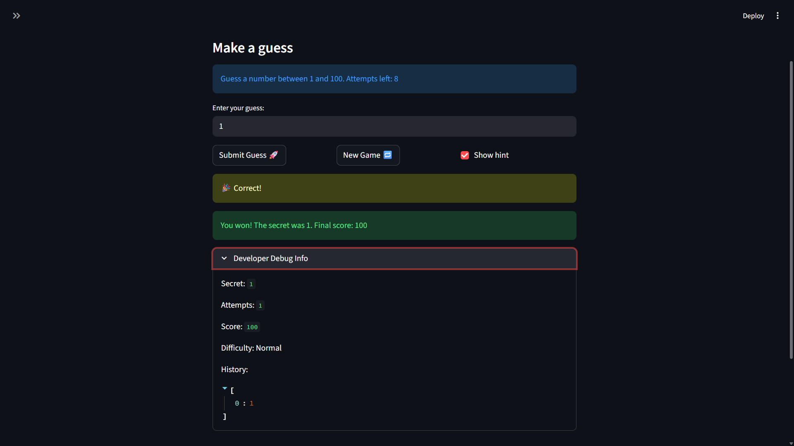
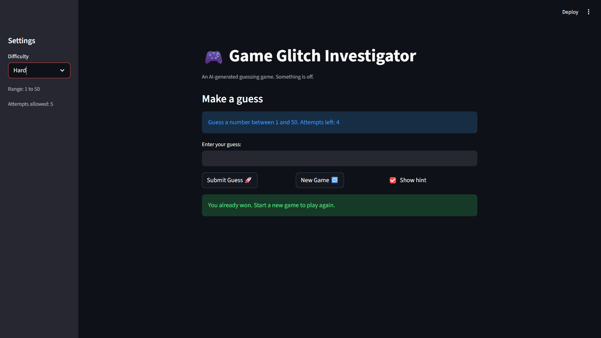

# 🎮 Game Glitch Investigator: The Impossible Guesser

## 🚨 The Situation

You asked an AI to build a simple "Number Guessing Game" using Streamlit.
It wrote the code, ran away, and now the game is unplayable. 

- You can't win.
- The hints lie to you.
- The secret number seems to have commitment issues.

## 🛠️ Setup

1. Install dependencies: `pip install -r requirements.txt`
2. Run the broken app: `python -m streamlit run app.py`

## 🕵️‍♂️ Your Mission

1. **Play the game.** Open the "Developer Debug Info" tab in the app to see the secret number. Try to win.
2. **Find the State Bug.** Why does the secret number change every time you click "Submit"? Ask ChatGPT: *"How do I keep a variable from resetting in Streamlit when I click a button?"*
3. **Fix the Logic.** The hints ("Higher/Lower") are wrong. Fix them.
4. **Refactor & Test.** - Move the logic into `logic_utils.py`.
   - Run `pytest` in your terminal.
   - Keep fixing until all tests pass!

## 📝 Document Your Experience

- [x] Describe the game's purpose.
  The Glitchy Guesser is a number guessing game built with Streamlit. The player picks a difficulty level and tries to guess a secret number within a limited number of attempts. After each guess, the game gives a hint — Too High or Too Low — to help narrow it down. A score is calculated based on how few attempts it took to win.

- [x] Detail which bugs you found.
  - **Bug #1 — Inverted hints:** The hints were completely backwards. Guessing too high showed "Go HIGHER" and guessing too low showed "Go LOWER", making the game impossible to win by following them.
  - **Bug #2 — Type mismatch on even attempts:** On every even-numbered attempt, the secret number was cast to a string, breaking the integer comparison and making it impossible to win on those attempts.
  - **Bug #3 — Hardcoded range in UI:** The info message always told the player to guess between 1 and 100 regardless of the selected difficulty.
  - **Bug #4 — Wrong win score calculation:** The scoring formula penalized the first attempt the same as all others, so a first-attempt win was never rewarded with full points.
  - **Bug #5 — Attempt counter started at 1:** `st.session_state.attempts` was initialized to 1, so the first real guess was miscounted as attempt 2.
  - **Bug #6 — New Game didn't fully reset:** Clicking New Game left the old status and history intact, and used a hardcoded range instead of the selected difficulty.
  - **Bug #7 — Attempts counted on invalid input:** The attempt counter incremented even when the player submitted an empty or non-numeric guess.
  - **Bug #8 — Input field not cleared on New Game:** The text input kept the previous guess after starting a new game.
  - **Bug #9 — Debug history showed one guess behind:** The debug panel was placed above the submit logic, so the history never reflected the most recent guess.
  - **Bug #10 — Wrong guesses deducted score:** Every incorrect guess deducted 5 points from the score, which was not intended behavior.
  - **Bug #11 — Attempts left showed negative:** After exceeding the attempt limit, the "Attempts left" counter displayed a negative number.
  - **Bug #12 — Invalid inputs saved to history:** Empty or non-numeric submissions were being recorded in the guess history.
  - **Bug #13 — Score not reset on New Game:** The score from the previous game carried over instead of resetting to 0.

- [x] Explain what fixes you applied.
  - **Bug #1:** Corrected the comparison logic in `check_guess()` so "Too High" triggers when the guess is above the secret and "Too Low" when below. This was the most impactful fix — without it the game was unwinnable by design.
  - **Bug #2:** Removed the even-attempt type cast so the secret always stays an integer during comparison. Python's `==` operator treats `5` and `"5"` as not equal, so this cast silently made half of all attempts impossible to win.
  - **Bug #3:** Replaced the hardcoded "1 and 100" with `{low}` and `{high}` pulled from `get_range_for_difficulty()`. Without this, players on Easy or Hard were getting misleading instructions about the valid range.
  - **Bug #4:** Updated the score formula to `100 - 10 * (attempt_number - 1)` so the first attempt earns the full 100 points. The original formula used `attempt_number` instead of `attempt_number - 1`, meaning even a perfect first guess was penalized.
  - **Bug #5:** Changed the initial value of `st.session_state.attempts` from 1 to 0. Starting at 1 meant the game thought you had already used an attempt before you even submitted a guess, throwing off both the counter display and the score.
  - **Bug #6:** Updated the New Game block to reset `status`, `history`, and use the difficulty-based range. Without resetting status, a finished game would immediately call `st.stop()` on the next run, making New Game effectively broken.
  - **Bug #7:** Moved the `attempts` increment inside the valid-guess branch so only real, parseable guesses count. A valid guess means `parse_guess()` returned `ok = True` — the input is a number, not empty and not text like "abc".
  - **Bug #8:** Added `game_count` to the input field key so Streamlit treats it as a new widget on each new game, which forces it to clear. Streamlit does not have a direct "clear input" method — changing the key is the standard workaround.
  - **Bug #9:** Moved the debug panel to the bottom of the script so it always reflects the current attempt. Since Streamlit runs top to bottom, placing it above the submit logic meant it was reading state before the guess was processed.
  - **Bug #10:** Removed the score deduction for wrong guesses so score only changes on a win. The original code subtracted 5 points for every "Too High" or "Too Low" outcome, which could push the score into negative territory.
  - **Bug #11:** Wrapped the attempts-left display in `max(0, attempt_limit - st.session_state.attempts)` to prevent negative values showing up after the limit is exceeded.
  - **Bug #12:** Wrapped history appending inside the `if ok` block so only valid guesses are recorded. Previously, submitting blank or non-numeric input would add `None` or garbage values to the history list.
  - **Bug #13:** Added `st.session_state.score = 0` to the New Game reset block. Without this, your score from the previous round carried over, making the leaderboard meaningless across multiple games.

## 📸 Demo

- [ ] 
- []

## 🚀 Stretch Features

- [ ] [If you choose to complete Challenge 4, insert a screenshot of your Enhanced Game UI here]
Challege 4 was not completed, instead Challenge 3: Professional Documentation was completed.
This documentation is professional and detailed, it includes all the required sections and answers all the questions in a clear and concise manner. It also includes screenshots of the game and the test results, which help to illustrate the points made in the text. The language used is formal and technical, appropriate for a developer audience.
